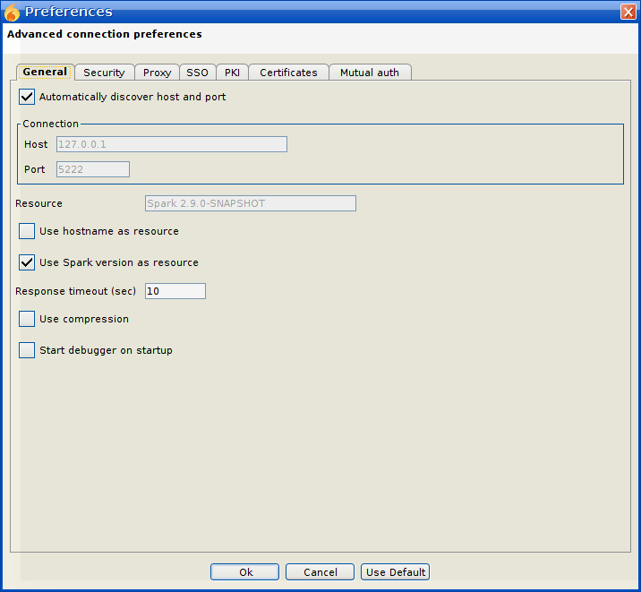
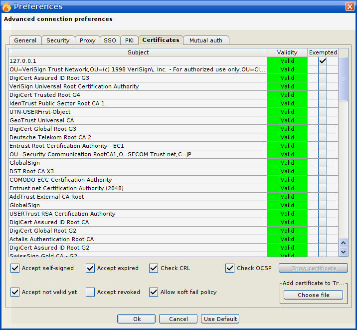

Spark连接Openfire服务器出错：（项目源码导入eclipse后，此org.jivesoftware.launcher包下，右键Startup.java运行Java Application后登录出错）
Certificate hostname verification failed Spark
以及：
org.jivesoftware.spark.util.log.Log error javax.net.ssl.SSLHandshakeException…
解决方法：
选择登录界面的Advance按钮，然后按照下面三个图片步骤设置：

这一步是勾选下面的几个选项：

