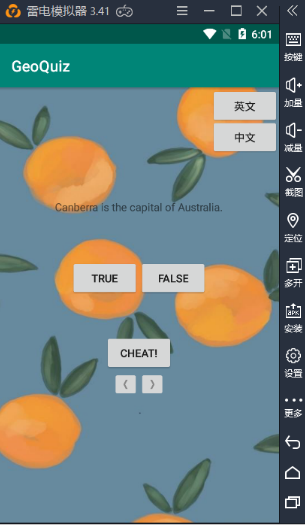

# 基于《Android编程权威指南》前5章完成的一个Android App
## 简介
上学期学了Android编程，期末做了一个课程设计--QuizGame（猜谜游戏）。
项目地址： https://github.com/Xiawen9/AndroidApp
有两个课程设计，分别是移动开发技术大作业和移动开发技术实验。以下是要求：

- 移动开发技术大作业
1、按照《Android编程权威指南》做完前五章，并完成挑战练习。
2、额外添加一个登录的Activity，登录后打开答题界面，用户名为本人学号，密码为111111。（用户名和密码必须匹配方可登陆成功，可采用SharedPreference存储用户名和密码）。
3、实现对中英文操作的支持（题目可以采用英文，但操作界面需提供中英文支持）。
- 移动开发技术实验
1、在移动开发技术大作业的基础上，做以下更改：
2、将题目保存在数据库中，使用内容提供者来对题目进行访问。

登录名是1610421036 密码是111111
### 移动开发技术大作业
一、 登录界面设计：
1、 介绍：
在该界面输入用户名、密码，点击登录按钮可登录至游戏界面。
2、运行界面截图：

3、主要文件及解释：

- Activity_login.xml：
	布局为相对布局（RelativeLayout），设置背景图片与前景图片，该布局使用两个LinearLayout，每个布局有一个TextView、一个EditText组成，再设置一个Button按钮。
- SpSaveLogin.java：
使用SharedPreferences存储用户名与密码。将用户名和密码保存到data.xml文件中。
- LoginActivity.java：
从data.xml文件中取出存储的用户名和密码，在此activity里判断，是否存在该账号及密码是否正确。如果正确，跳转至QuizActivity界面。	

二、 游戏界面设计：
1、 介绍：
该界面实现题目更新、答题按钮、作弊、查看下一题、查看上一题、答题正确与否提示、游戏得分统计、中英文切换功能。
2、运行界面截图：

中英文切换后：

3、主要文件及解释：

- Question.java：
	该代码显示问题的相关属性（问题标号，问题，是否回答过，答案）。
- activity_quiz.xml：
	该界面使用相对布局，放置两个Button实现中英文切换，一个TextView显示问题，一个线性布局中的两个button用于回答问题，一个作弊按钮，一个线性布局中的两个ImageButton用来查看上一题与下一题。
- QuizActivity.java：
一个Question数组，存放问题。

4、逻辑处理：

- 更新问题：
	由mCurrentIndex的值，取出问题数组的相关问题，显示题目，并把答题按钮设置为不可答状态。
- 核对答案：
	将用户选择问题的按钮与问题数组存放的问题答案进行对比，以Toast返回正确或错误。
- 切换语言：
	该QuizActivity类继承View.OnClickListener，所以可以重写onClick()函数，由id值判断点击并切换语言。在此之前，需在values下面的string.xml文件中添加resources，zh-rCN下面的string.xml也需要添加。
- 切换到游戏结束界面：
	传递得分数据
	使用setEnabled()而使按钮失效。
	按钮点击实现响应事件：
	mTrueButton、mFalseButton点击调用checkAnswer()函数，核对答案；
	mNextButton点击调用updateQuestion()函数，当答题结束后调用changeActivity()函数，跳转到游戏结束界面；
	mCheatButton点击跳转到CheatActivity界面；
	mPreButton点击更新问题；

三、 作弊界面设计：
1、 介绍
该界面实现查看题目答案功能。
2、 运行界面截图：

3、 主要文件及解释：
- activity_cheat.xml：
	该布局由两个TextView与一个Button组成，显示答案。
- CheatActivity.java：
该界面接收QuizActivity界面的跳转，获得回传数据，显示传递的数据。

四、 结束界面设计：
1、 介绍：
接受QuizActivity的跳转，接受分数，将分数显示在此界面，提示游戏结束。
2、 运行界面截图：

3、主要代码截图及解释：

- activity_over.xml:
该界面由三个TextView组成，分别显示游戏结束、当前得分、分数显示。
- OverActivity.java：
获取从QuizActivity传递过来的得分，并显示。

### 移动开发技术实验
一、新增代码文件：

- Question.java：
	新增mQuestionText属性，存储问题，并更改构造方法。MyContentProvider.java：提供数据库的查询操作。

- QuizDBOpenHelper.java：
	数据库帮助者中，实现数据库表创建，以及将题目插入表中。

- 更改AndroidManifest.xml：
	
- QuizActivity.java：
	在QuizActiviy.java中，将数据库中的数据存放在数组中，并在updateQuestion()函数中，将题目内容取出来，显示。